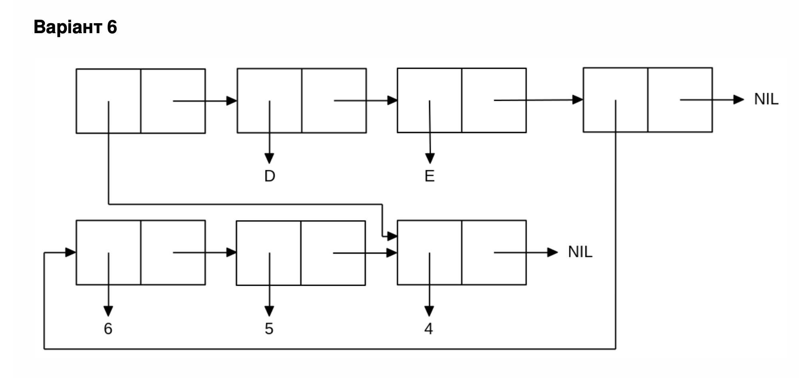

<p align="center"><b>МОНУ НТУУ КПІ ім. Ігоря Сікорського ФПМ СПіСКС</b></p>
<p align="center">
<b>Звіт з лабораторної роботи 1</b><br/>
"Обробка списків з використанням базових функцій"<br/>
дисципліни "Вступ до функціонального програмування"
</p>
<p align="right">**Студент(-ка)**: *Іващук Дмитро Сергійович. КВ-13*<p>
<p align="right">**Рік**: *2024*<p>


## Загальне завдання

1. Створіть список з п'яти елементів, використовуючи функції LIST і CONS . Форма створення списку має бути одна — використання SET чи SETQ (або інших допоміжних форм) для збереження проміжних значень не допускається. Загальна кількість елементів (включно з підсписками та їх елементами) не має перевищувати 10-12 шт. (дуже великий список робити не потрібно). Збережіть створений список у якусь змінну з SET або SETQ . Список має містити (напряму або у підсписках): 
* хоча б один символ 
* хоча б одне число 
* хоча б один не пустий підсписок
* хоча б один пустий підсписок 
2. Отримайте голову списку. 
3. Отримайте хвіст списку. 
4. Отримайте третій елемент списку. 
5. Отримайте останній елемент списку. 
6. Використайте предикати ATOM та LISTP на різних елементах списку (по 2-3 приклади для кожної функції). 
7. Використайте на елементах списку 2-3 інших предикати з розглянутих у розділі 4 навчального посібника. 
8. Об'єднайте створений список з одним із його непустих підсписків. Для цього використайте функцію APPEND. 


```lisp

;; 1
(defvar the_list nil)
(setq the_list
    (cons 'm
          (cons 'y
                (cons '4
                      (cons (list 'a 'p 'l)
                            (list 'k (list 28 29) nil))))))
;; (M Y 4 (A P L) K (28 29) NIL)

;; 2
(car the_list)
;; M 

;; 3
(cdr the_list)
;; (Y 4 (A P L) K (28 29) NIL)

;; 4
(nth 2 the_list)
;; 4

;; 5
(car (last the_list))
;; NIL

;; 6
(atom (last the_list))
;; NIL

(atom (nth 2 the_list))
;; T

(listp (car the_list))
;; NIL

(listp (nth 2 the_list))
;; NIL


;; 7
(* (nth 2 the_list) 4)
;; 16

(nthcdr 3 the_list)
;;((A P L) K (28 29) NIL)

(null (last the_list))
;; NIL

;; 8
(append the_list (nth 3 the_list))
;; (M Y 4 (A P L) K (28 29) NIL A P L) 

```

## Варіант 6

<p align="center">

</p>

```lisp

(defvar var_list nil)
(defvar auxiliary_list nil)
(setq auxiliary_list (list 6 5 4))
(setq var_list (list (last auxiliary_list) 'd 'e auxiliary_list))
((4) D E (6 5 4))

```

